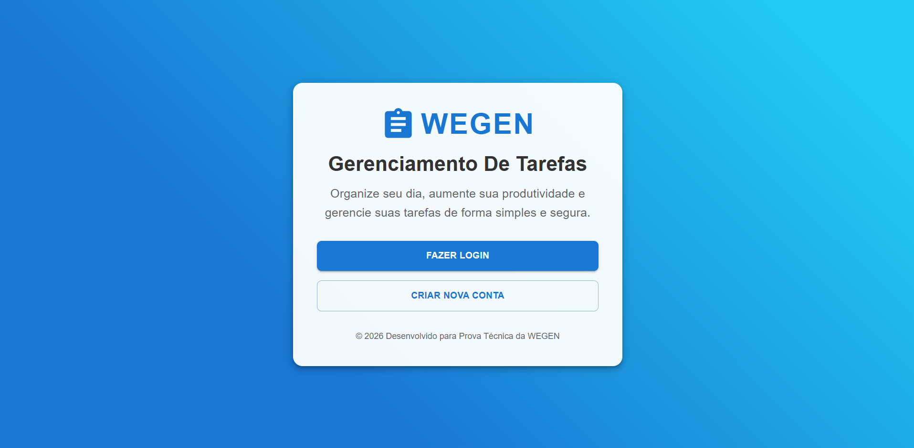
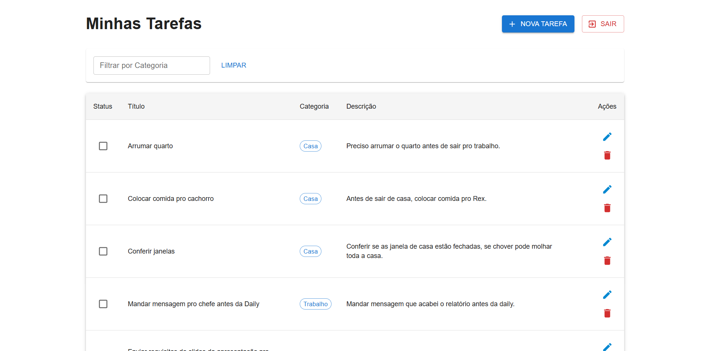

# 🚀 WEGEN - Gerenciamento de Tarefas

Aplicação Full Stack desenvolvida para gerenciamento de tarefas (To-Do List) com sistema de autenticação, categorização e filtragem. O projeto utiliza uma arquitetura moderna com **ASP.NET Core Web API** no backend e **React com TypeScript** no frontend.

---

## 📸 Screenshots

| Home Page | Dashboard |
| :---: | :---: |
|  |  |
| *Tela inicial de acesso* | *Gerenciamento de tarefas do usuário* |

---

## 🛠 Tecnologias Utilizadas

### **Backend**
* **C# (.NET 8):** Framework principal para construção da API.
* **Entity Framework Core:** ORM para mapeamento e comunicação com o banco.
* **PostgreSQL:** Banco de dados relacional para persistência.
* **JWT (JSON Web Token):** Segurança e autenticação das rotas.
* **BCrypt.Net:** Criptografia de senhas (hashing).
* **Swagger/OpenAPI:** Documentação e teste das rotas da API.

### **Frontend**
* **React (Vite):** Biblioteca para construção da interface SPA.
* **TypeScript:** Tipagem estática para código mais robusto.
* **Material-UI (MUI):** Biblioteca de componentes para design moderno e responsivo.
* **Axios:** Cliente HTTP para integração com o Backend.
* **React Router Dom:** Gerenciamento de rotas e proteção de páginas privadas.

---

## ⚙️ Como Rodar o Projeto

### **Pré-requisitos**
* SDK do .NET 8.
* Node.js (versão 18 ou superior).
* PostgreSQL instalado e rodando.

---

### **1. Configuração do Backend**

1. Acesse a pasta do servidor:
   ```bash
   cd todo-api
   ```

2. Abra o arquivo appsettings.json e configure a sua string de conexão com o PostgreSQL:
   ```bash
   "ConnectionStrings": {
        "DefaultConnection": "Host=localhost;Port=5432;Database=todo_db;Username=SEU_USUARIO;Password=SUA_SENHA"
    }
   ```
3. Execute no terminal as Migrations para criar as tabelas no banco  de dados automaticamente:
   ```bash
   dotnet ef database update
   ```
4. Inicie a API::
   ```bash
   dotnet run
   ```

   > **Dica:**  A API estará disponível em: http://localhost:5055 (ou na porta indicada no terminal).

   ---
### **2. Configuração do Frontend**

1. En um outro terminal, navegue até a pasta do cliente:
   ```bash
   cd todo-web
   ```

2. Instale as dependências do projeto:
   ```bash
   npm install
   ```
3. Inicie a aplicação em modo de desenvolvimento:
   ```bash
   npm run dev
   ```
   > **Dica:**  O frontend estará disponível em: http://localhost:5173.

   ---

## 📝 Funcionalidades Implementadas

* [x] **Autenticação:** Registro e Login de usuários com criptografia de senha (BCrypt).
* [x] **Segurança:** Persistência de sessão com Token JWT enviado via Header Authorization nas requisições.
* [x] **CRUD Completo:** Criar, Listar, Editar e Excluir tarefas vinculadas exclusivamente ao usuário logado.
* [x] **Filtros:** Filtragem dinâmica de tarefas por categoria.
* [x] **UX/UI:** Interface moderna e responsiva construída com Material-UI, incluindo Modais para edição e alertas de feedback.
* [x] **Arquitetura:** Separação clara entre cliente e servidor com comunicação via API REST.

---

## 👨‍💻 Desenvolvedor
Projeto desenvolvido por **João** como parte de uma prova técnica para Desenvolvedor Full Stack.

